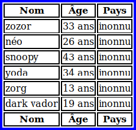

Reproduire l'image :

Pour le CSS, le mettre dans une **balise style**.
Pour faire le tableau, il faut se servir des balises **thead**, **tfoot** et **tbody**.
Vous ne devez pas utiliser d'attributs dans cet exercice.